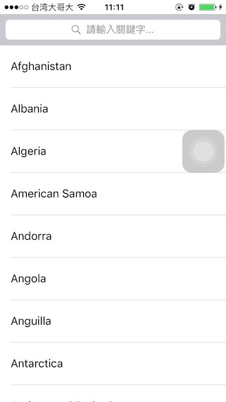
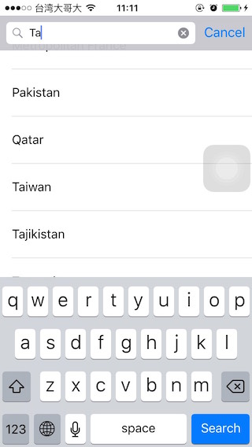
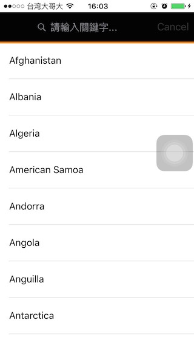
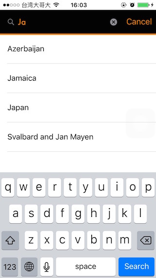

# AppCoda_SearchBar

Screenshot:
-----------
**Default:**

**Custom:**

Usage:
----------

    ViewController.swift 

        1. //Default search bar
           configureSearchController()
        
        2. //Custom search bar
           configureCustomSearchController()

Reference:
---------- 

[AppCoda中文: 如何利用UISearchController添加搜尋功能並打造客製化搜尋列](http://www.appcoda.com.tw/custom-search-bar-tutorial/)
  
    
